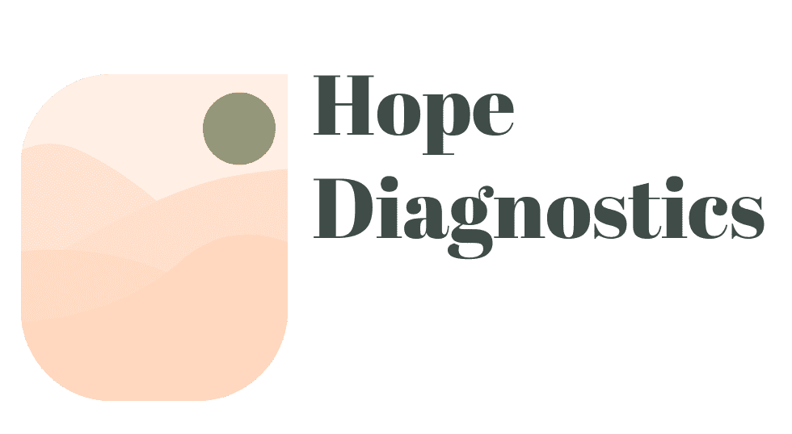

Hope Diagnostics is an online symptom checker web application designed and built 
by Segun Ayodele as the second milestone project at Code Institute. Hope Diagnostics 
is primarily for patients who cannot access the regular medical services because of 
remoteness or social distancing as the case is during the Covid-19 pandemic outbreak.
Through entered symptoms into the web app, Hope Diagnostics returns possible diseases 
the patient may be suffering from.
Furthermore, Hope Diagnostics also provides its users the service of scheduling call 
sessions with doctors for medical advice.

## UX
### Users Goal
* To access medical diagnosis services remotely.
* To help decide if symptoms are worth visiting the hospital for.
* To schedule a call session with Hope Diagnostics doctors for medical advice.

### Business Goal
* To provide instant medical diagnostic services to patients remotely located 
   or cannot visit an hopital for some other reasons.
* To provide quick and accesssible medical advice through call sessions with 
   doctors and the 24 hour helpline.
* To reduce the number of false alarms through instant diagnosis thereby easing
   the pressure on the health care system.

### User Story
#### Persona
Andriana is a single mum of 5 year old son, she works works as a sue chef in a
restuarant.
Andriana has been mildly symptomatic and she resumes her next shift at work in 24 
hours. As a Hope Diagnostics user I want/need/expect to:
* Carry out diagnosis on my symptoms to know the severity of my condition there by informing my next line of action such as visit the hospital or self-isolate.
* Find out the illness my symtoms are related to.
* Schedule a call session with Hope Diagnostics doctors for cross examination and advice.

She wants to find out if her symptoms are stress related or something serious
that may require a visit to the hopital or isolating herself to protect son and others.

### Design Choice

**Fonts**
* Open Sans
* Roboto

**Colour**

**WireFrame**

## Features

## Technology Used

### Tools
* __Adobe Illustrator__ used for wireframe design.
* __Adobe Photoshop__ used for image resize and compression.
* __Git__ for version control

### Libraries
* [Bootstrap](https://getbootstrap.com/)
* [Google Fonts](https://fonts.google.com/)
* [jQuery](https://jquery.com/)
* [Font Awasome](https://fontawesome.com/)

### Programming Languages
* HTML
* CSS 
* Javascript

## Deployment

## Credits
### Content
* The text "from How it works section" on the home is copied from 
[Healthcare Direct](https://www.healthdirect.gov.au/symptom-checker)
### Media
* The photos used for this project were obtained from the following links
    * [Cardiology Doctor](https://epmgaa.media.clients.ellingtoncms.com/img/photos/2016/02/04/Screen_Shot_2016-02-04_at_6.52.32_PM_t750x550.png?d885fc46c41745b3b5de550c70336c1b382931d2)
    * [General Medicine](https://lincolnplacemedical.ie/team-member/dr-michelle-rodgers/doctor/)
    * [Psychiatry Doctor](https://nationaltoday.com/doctors-day/)

## Acknowledgement

I recieved inspiration and references from the following symptom checker 
web applications:
* [Healthcare Direct](https://www.healthdirect.gov.au/symptom-checker)
* [Mayo Clinic](https://www.mayoclinic.org/)
* [WebMD](https://symptoms.webmd.com/default.htm)
* [Isabel](https://symptomchecker.isabelhealthcare.com/)

