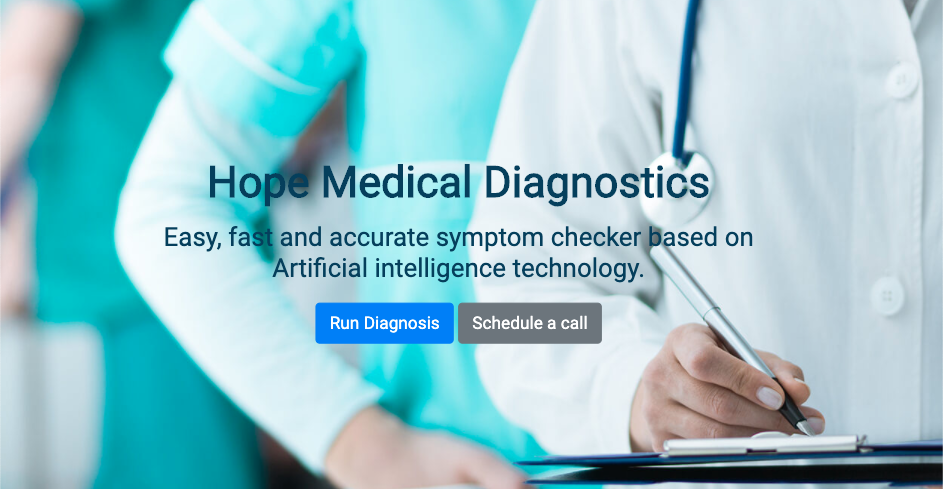
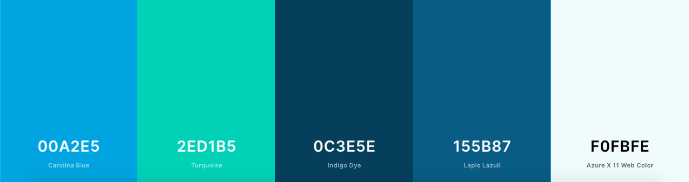
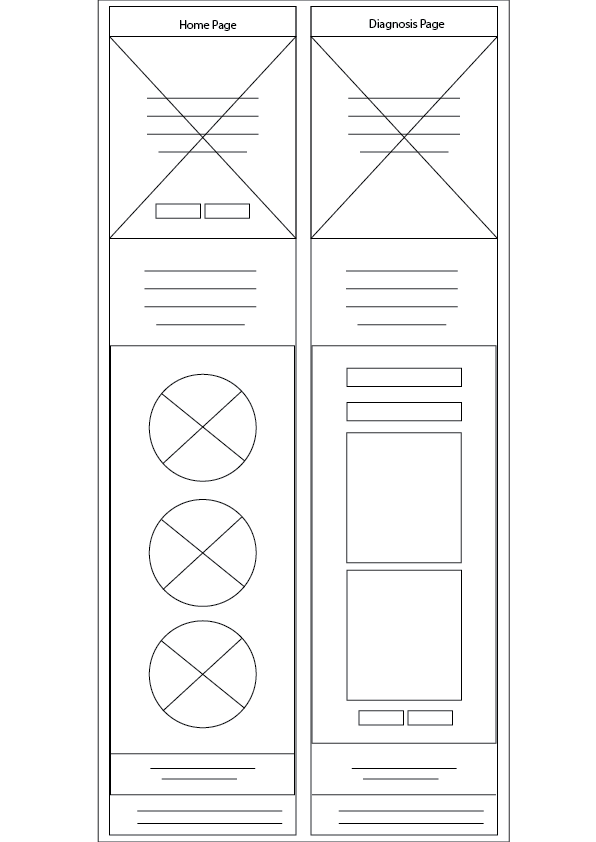
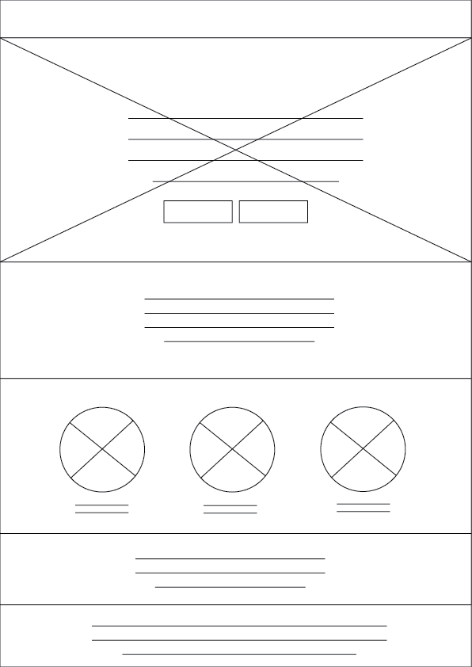
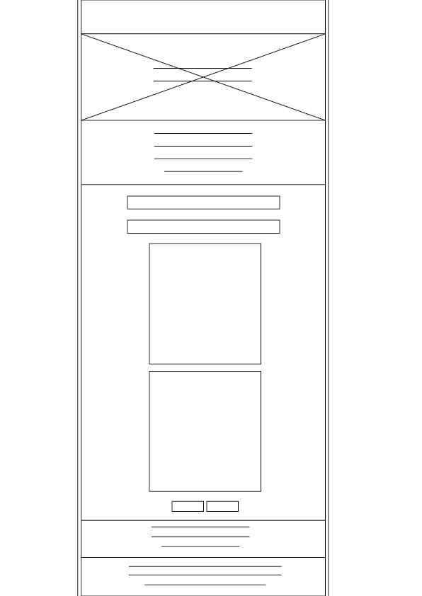
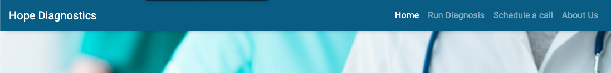
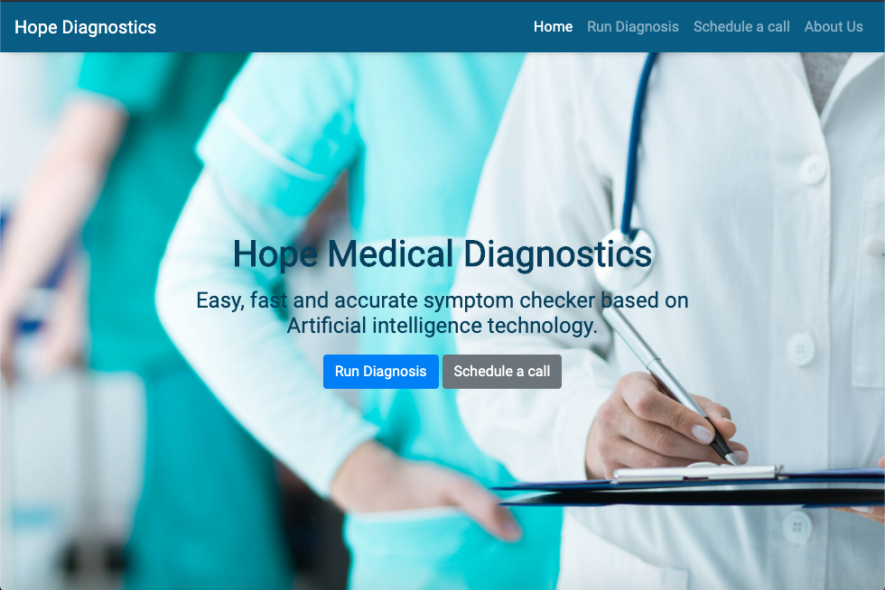
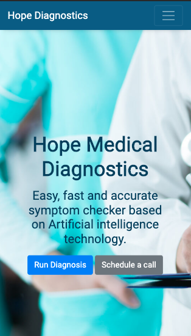
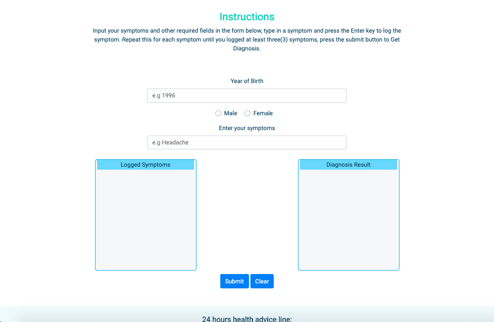
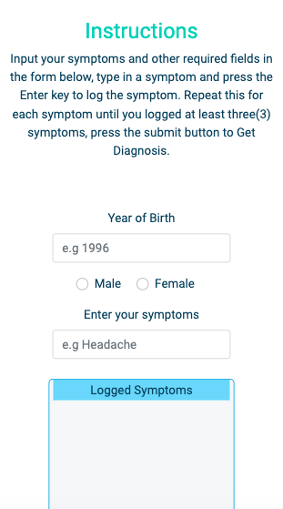

Hope Diagnostics is an online symptom checker web application designed and built 
by Segun Ayodele as the second milestone project at Code Institute. Hope Diagnostics 
is primarily for patients who cannot access the regular medical services because of 
remoteness or social distancing as the case is during the Covid-19 pandemic outbreak.
Through entered symptoms into the web app, Hope Diagnostics returns possible diseases 
the patient may be suffering from.
Furthermore, Hope Diagnostics also provides its users the service of scheduling call 
sessions with doctors for medical advice.

## UX
### Users Goal
* To access medical diagnosis services remotely.
* To help decide if symptoms are worth visiting the hospital for.
* To schedule a call session with Hope Diagnostics doctors for medical advice.

### Business Goal
* To provide instant medical diagnostic services to patients remotely located 
   or cannot visit an hopital for some other reasons.
* To provide quick and accesssible medical advice through call sessions with 
   doctors and the 24 hour helpline.
* To reduce the number of false alarms through instant diagnosis thereby easing
   the pressure on the health care system.

### User Story
#### Persona
Andriana is a single mum of 5 year old son, she works works as a sue chef in a
restuarant.
Andriana has been mildly symptomatic and she resumes her next shift at work in 24 
hours. As a Hope Diagnostics user I want/need/expect to:
* Carry out diagnosis on my symptoms to know the severity of my condition there by informing my next line of actions such as going to the hospital or self-isolate.
* Find out the illness my symtoms are related to.
* Schedule a call session with Hope Diagnostics doctors for further cross examination and advice.

### Design Choice

**Fonts**
* Open Sans
* Roboto

**Colour**

**WireFrame**
* Mobile view

## Features
### Existing Features
* __Navbar__ is featured on all the pages and contains the menu-links for navigation around the website.

* __Footer__ also featured on every page and contains the social media icons and navigation links around the website.

* __Home page__ is the landing page with medically inclined image and a short pitch of the diagnostic web application 
with buttons to schedule a call session with doctors and the other links to the diagnosis page.
The home also features how the web application works and images of the leading doctors of Hope Diagnostics.
 
* __Diagnosis page__ features the instruction on how to use the diagnosis system and right below is the patient's 
data input point for the diagnosis. Also on the this page is navbar and the footer.
 

## Technology Used

### Tools
* __Adobe Illustrator__ used for wireframe design.
* __Adobe Photoshop__ used for image resize and compression.
* __Git__ for version control
* __Coolors__ for color palette generation

### Libraries
* [Bootstrap](https://getbootstrap.com/) To simplify the responsiveness and the structure of the website.
* [Google Fonts](https://fonts.google.com/) for font styling.
* [jQuery](https://jquery.com/) To simplify DOM manipulation.
* [Font Awasome](https://fontawesome.com/) To incorporate icons.
* [Apimedic API](https://apimedic.com/news) Provides the data for the web application.

### Programming Languages
* HTML
* CSS 
* Javascript

## Test
The following tools were used to validate and beautify the codes:
* [Freeformatter](https://www.freeformatter.com/html-formatter.html#ad-output) used to beautify the HTML code.
* [BeautyTools](http://beautifytools.com/css-validator.php) used to beautify and validate the Javascript and CSS codes.

The navigation of this website has been tested, and every button works with the exception of the social media icon and the About Us page.
The website responsiveness has also been tested at all screen sizes and it adapts and displays properly.
The test carried out on the functionality of the diagnosis web application includes:
* XMLHttpRequest and Response for symptom JSON.
* User Input Iteration through the symptom JSON.
* User symptom input autocomplete through iteration of symptom JSON
* Symptom ID appended into an array from Iteration result.
* Token auto generator request.
* User is alerted on symptom typo error.
* XMLHttpRequest and Response for diagnosis JSON.
* Diagnosis result returned and displayed on submission.

The above listed functionalities were tested and works as expected.

To test the diagnosis web app, use the following combinations of symptoms:
* __Test 1__ 
    * Year of birth:1995 
    * Sex: female
    * Symptoms: abdominal pain, fever

* __Test 2__
    * Year of birth:1990
    * Sex: male
    * Symptoms: fever, headache, abdominal pain.

* __Test 3__
    * Year of birth:1992
    * Sex: male
    * Symptoms: back pain, abdominal pain.    

### Limitations
* The API endpoint used in this project is the Sandbox, which returns a dummy 
diagnostic data. I decided use the Sandbox because the live API is often offline.
* The clear button only clears the logged symptoms and Diagnosis 
results, the year of birth and sex remains until page reloads or manually removed.
* when symptom combinations returns no diagnosis result, there is no message to 
alert the user.
* Because of time constraint, the schedule generator API could not be integrated 
into the website, instead the schedule button links an external schedule generator service.
* The About us page was not designed

## Deployment
Hope Diagnostics is deployed and hosted on github pages. 
From the repository, I clicked setting then selected a theme under the section of github 
pages. I then wrote about Curryt website then commit the changes. Finally, I added my repository 
name for it to be searchable.

## Credits
### Content
* The text "from How it works section" on the home is copied from 
[Healthcare Direct](https://www.healthdirect.gov.au/symptom-checker)
### Media
* The photos used for this project were obtained from the following links
    * [Cardiology Doctor](https://epmgaa.media.clients.ellingtoncms.com/img/photos/2016/02/04/Screen_Shot_2016-02-04_at_6.52.32_PM_t750x550.png?d885fc46c41745b3b5de550c70336c1b382931d2)
    * [General Medicine](https://lincolnplacemedical.ie/team-member/dr-michelle-rodgers/doctor/)
    * [Psychiatry Doctor](https://nationaltoday.com/doctors-day/)

## Acknowledgement

I recieved inspiration and references from the following sources:
* [Healthcare Direct](https://www.healthdirect.gov.au/symptom-checker)
* [Mayo Clinic](https://www.mayoclinic.org/)
* [WebMD](https://symptoms.webmd.com/default.htm)
* [Isabel](https://symptomchecker.isabelhealthcare.com/)
* [Quick Autocomplete App With JS & JSON](https://www.youtube.com/watch?v=1iysNUrI3lw)
* [JavaScript Higher Order Functions & Arrays](https://www.youtube.com/watch?v=rRgD1yVwIvE)
* [Async JS Crash Course - Callbacks, Promises, Async Await](https://www.youtube.com/watch?v=PoRJizFvM7s)

